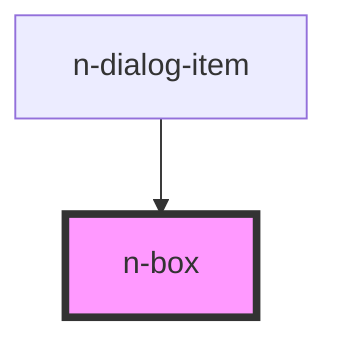

# n-box

<!-- Auto Generated Below -->

## Properties

| Property    | Attribute   | Description | Type                                       | Default  |
| ----------- | ----------- | ----------- | ------------------------------------------ | -------- |
| `elevation` | `elevation` |             | `"large" \| "medium" \| "none" \| "small"` | `'none'` |

## Dependencies

### Used by

 - [n-dialog-item](../dialog)

### Graph

----------------------------------------------

*Built with [StencilJS](https://stenciljs.com/)*
