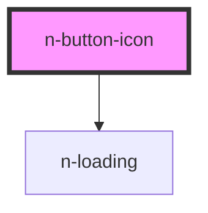

# n-button-icon

<!-- Auto Generated Below -->

## Properties

| Property   | Attribute  | Description | Type                                                   | Default                     |
| ---------- | ---------- | ----------- | ------------------------------------------------------ | --------------------------- |
| `color`    | `color`    |             | `"blue" \| "gray" \| "green" \| "red"`                 | `BUTTON_COLOR.GREEN`        |
| `disabled` | `disabled` |             | `boolean`                                              | `false`                     |
| `loading`  | `loading`  |             | `boolean`                                              | `false`                     |
| `size`     | `size`     |             | `"large" \| "middle" \| "mini" \| "small" \| "xsmall"` | `BUTTON_SIZE.MIDDLE`        |
| `type`     | `type`     |             | `"button" \| "reset" \| "submit"`                      | `BUTTON_NATIVE_TYPE.BUTTON` |
| `variant`  | `variant`  |             | `"fill" \| "flat" \| "outline" \| "plain"`             | `BUTTON_VARIANT.FILL`       |

## Dependencies

### Depends on

- [n-loading](../../spinner/loading)

### Graph

----------------------------------------------

*Built with [StencilJS](https://stenciljs.com/)*
