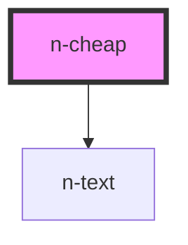

# n-cheap

<!-- Auto Generated Below -->

## Properties

| Property     | Attribute     | Description | Type                                               | Default     |
| ------------ | ------------- | ----------- | -------------------------------------------------- | ----------- |
| `closable`   | `closable`    |             | `boolean`                                          | `true`      |
| `color`      | `color`       |             | `"blue" \| "gray" \| "green" \| "red" \| "yellow"` | `'gray'`    |
| `label`      | `label`       |             | `number \| string`                                 | `''`        |
| `modelValue` | `model-value` |             | `boolean`                                          | `undefined` |
| `selectable` | `selectable`  |             | `boolean`                                          | `false`     |
| `showIcon`   | `show-icon`   |             | `boolean`                                          | `false`     |
| `size`       | `size`        |             | `"middle" \| "small"`                              | `'middle'`  |
| `variant`    | `variant`     |             | `"fill" \| "outline" \| "plain"`                   | `'fill'`    |

## Events

| Event              | Description | Type                   |
| ------------------ | ----------- | ---------------------- |
| `close`            |             | `CustomEvent<void>`    |
| `updateModelValue` |             | `CustomEvent<boolean>` |

## Dependencies

### Depends on

- [n-text](../typography/text)

### Graph

----------------------------------------------

*Built with [StencilJS](https://stenciljs.com/)*
