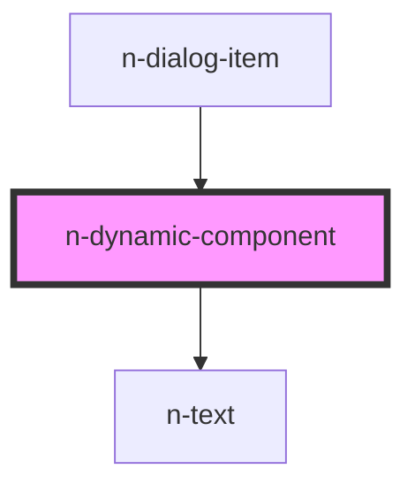

# n-dynamic-component

<!-- Auto Generated Below -->

## Properties

| Property               | Attribute | Description | Type                                                        | Default     |
| ---------------------- | --------- | ----------- | ----------------------------------------------------------- | ----------- |
| `class`                | `class`   |             | `string`                                                    | `undefined` |
| `content` _(required)_ | `content` |             | `string \| { component: any; props: Record<string, any>; }` | `undefined` |

## Dependencies

### Used by

 - [n-dialog-item](.)

### Depends on

- [n-text](../typography/text)

### Graph

----------------------------------------------

*Built with [StencilJS](https://stenciljs.com/)*
