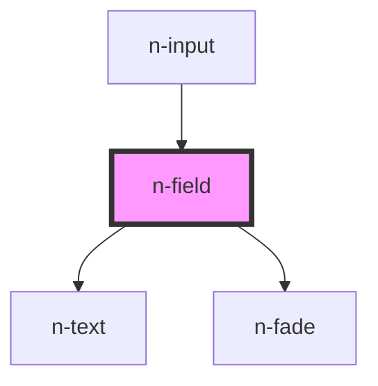

# n-field

<!-- Auto Generated Below -->

## Properties

| Property        | Attribute        | Description | Type                | Default |
| --------------- | ---------------- | ----------- | ------------------- | ------- |
| `error`         | `error`          |             | `string`            | `''`    |
| `label`         | `label`          |             | `string`            | `''`    |
| `labelPosition` | `label-position` |             | `"inline" \| "top"` | `'top'` |
| `required`      | `required`       |             | `boolean`           | `false` |
| `requiredSign`  | `required-sign`  |             | `boolean`           | `true`  |
| `showError`     | `show-error`     |             | `boolean`           | `true`  |

## Dependencies

### Used by

 - [n-input](../input)

### Depends on

- [n-text](../typography/text)
- [n-fade](../transitions/fade)

### Graph

----------------------------------------------

*Built with [StencilJS](https://stenciljs.com/)*
