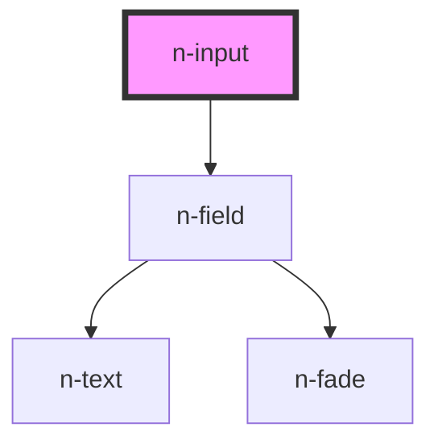

# n-input

<!-- Auto Generated Below -->

## Properties

| Property                  | Attribute                     | Description | Type                                                                  | Default     |
| ------------------------- | ----------------------------- | ----------- | --------------------------------------------------------------------- | ----------- |
| `changeValueOnMouseWheel` | `change-value-on-mouse-wheel` |             | `boolean`                                                             | `true`      |
| `clearable`               | `clearable`                   |             | `boolean`                                                             | `false`     |
| `disabled`                | `disabled`                    |             | `boolean`                                                             | `false`     |
| `error`                   | `error`                       |             | `string`                                                              | `''`        |
| `forceEnDigit`            | `force-en-digit`              |             | `boolean`                                                             | `true`      |
| `inputClass`              | `input-class`                 |             | `string`                                                              | `''`        |
| `label`                   | `label`                       |             | `string`                                                              | `''`        |
| `labelPosition`           | `label-position`              |             | `"inline" \| "top"`                                                   | `'top'`     |
| `max`                     | `max`                         |             | `number`                                                              | `Infinity`  |
| `min`                     | `min`                         |             | `number`                                                              | `-Infinity` |
| `modelValue`              | `model-value`                 |             | `number \| string`                                                    | `''`        |
| `placeholder`             | `placeholder`                 |             | `string`                                                              | `''`        |
| `required`                | `required`                    |             | `boolean`                                                             | `false`     |
| `requiredSign`            | `required-sign`               |             | `boolean`                                                             | `true`      |
| `rows`                    | `rows`                        |             | `number \| string`                                                    | `3`         |
| `showError`               | `show-error`                  |             | `boolean`                                                             | `false`     |
| `size`                    | `size`                        |             | `"middle" \| "mini" \| "small"`                                       | `'middle'`  |
| `step`                    | `step`                        |             | `number`                                                              | `1`         |
| `type`                    | `type`                        |             | `"number" \| "password" \| "search" \| "tel" \| "text" \| "textarea"` | `'text'`    |

## Events

| Event              | Description | Type                            |
| ------------------ | ----------- | ------------------------------- |
| `updateModelValue` |             | `CustomEvent<number \| string>` |

## Dependencies

### Depends on

- [n-field](../field)

### Graph

----------------------------------------------

*Built with [StencilJS](https://stenciljs.com/)*
