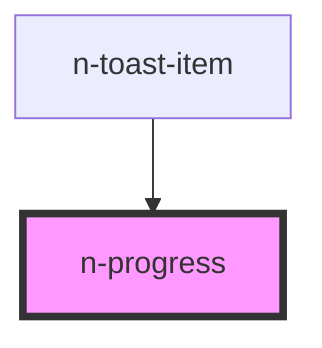

# n-progress

<!-- Auto Generated Below -->

## Properties

| Property                           | Attribute               | Description | Type     | Default     |
| ---------------------------------- | ----------------------- | ----------- | -------- | ----------- |
| `backgroundColorCode` _(required)_ | `background-color-code` |             | `string` | `undefined` |
| `percentage`                       | `percentage`            |             | `number` | `0`         |
| `progressColorCode`                | `progress-color-code`   |             | `string` | `'white'`   |
| `size`                             | `size`                  |             | `number` | `10`        |

## Dependencies

### Used by

 - [n-toast-item](../../toast)

### Graph

----------------------------------------------

*Built with [StencilJS](https://stenciljs.com/)*
