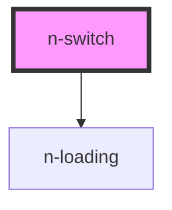

# n-switch

<!-- Auto Generated Below -->

## Properties

| Property        | Attribute        | Description | Type                                       | Default             |
| --------------- | ---------------- | ----------- | ------------------------------------------ | ------------------- |
| `disabled`      | `disabled`       |             | `boolean`                                  | `false`             |
| `label`         | `label`          |             | `string`                                   | `''`                |
| `labelPosition` | `label-position` |             | `LabelPosition.End \| LabelPosition.Start` | `LabelPosition.End` |
| `loading`       | `loading`        |             | `boolean`                                  | `false`             |
| `modelValue`    | `model-value`    |             | `boolean`                                  | `undefined`         |

## Events

| Event              | Description | Type                   |
| ------------------ | ----------- | ---------------------- |
| `modelValueChange` |             | `CustomEvent<boolean>` |

## Dependencies

### Depends on

- [n-loading](../spinner/loading)

### Graph

----------------------------------------------

*Built with [StencilJS](https://stenciljs.com/)*
