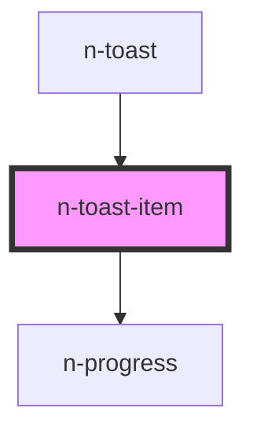

# n-toast-item

<!-- Auto Generated Below -->

## Properties

| Property               | Attribute   | Description | Type                                                                           | Default             |
| ---------------------- | ----------- | ----------- | ------------------------------------------------------------------------------ | ------------------- |
| `closable`             | `closable`  |             | `boolean`                                                                      | `true`              |
| `depth` _(required)_   | `depth`     |             | `number`                                                                       | `undefined`         |
| `duration`             | `duration`  |             | `number`                                                                       | `3000`              |
| `enabled`              | `enabled`   |             | `boolean`                                                                      | `true`              |
| `index` _(required)_   | `index`     |             | `number`                                                                       | `undefined`         |
| `loading`              | `loading`   |             | `boolean`                                                                      | `false`             |
| `message`              | `message`   |             | `string`                                                                       | `''`                |
| `offset`               | `offset`    |             | `number`                                                                       | `0`                 |
| `position`             | `position`  |             | `Position.Bottom \| Position.Top`                                              | `Position.Bottom`   |
| `queued`               | `queued`    |             | `boolean`                                                                      | `false`             |
| `removed`              | `removed`   |             | `boolean`                                                                      | `false`             |
| `showIcon`             | `show-icon` |             | `boolean`                                                                      | `false`             |
| `toastId` _(required)_ | `toast-id`  |             | `string`                                                                       | `undefined`         |
| `variant`              | `variant`   |             | `Variants.Alert \| Variants.Negative \| Variants.Neutral \| Variants.Positive` | `Variants.Positive` |

## Events

| Event       | Description | Type                  |
| ----------- | ----------- | --------------------- |
| `remove`    |             | `CustomEvent<string>` |
| `removeAll` |             | `CustomEvent<void>`   |

## Dependencies

### Used by

 - [n-toast](.)

### Depends on

- [n-progress](../spinner/progress)

### Graph

----------------------------------------------

*Built with [StencilJS](https://stenciljs.com/)*
