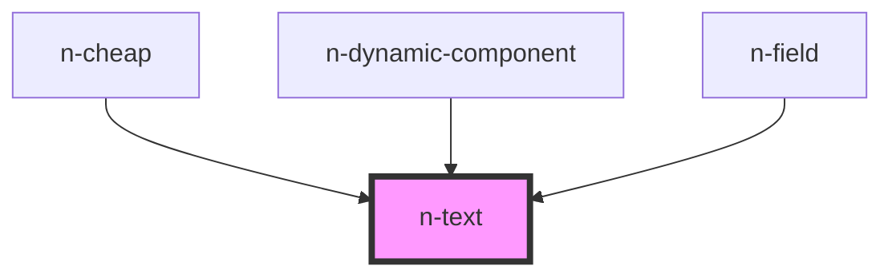

# n-text

<!-- Auto Generated Below -->

## Properties

| Property  | Attribute | Description | Type                                                                                                               | Default     |
| --------- | --------- | ----------- | ------------------------------------------------------------------------------------------------------------------ | ----------- |
| `tag`     | `tag`     |             | `"a" \| "b" \| "h1" \| "h2" \| "h3" \| "h4" \| "h5" \| "h6" \| "i" \| "label" \| "p" \| "small" \| "span"`         | `'span'`    |
| `variant` | `variant` |             | `"2xl" \| "3xl" \| "body" \| "caption1" \| "caption2" \| "h1" \| "h2" \| "h3" \| "overline" \| "subtitle" \| "xl"` | `'body'`    |
| `weight`  | `weight`  |             | `"bold" \| "medium" \| "regular"`                                                                                  | `'regular'` |

## Dependencies

### Used by

 - [n-cheap](../../cheap)
 - [n-dynamic-component](../../dialog)
 - [n-field](../../field)

### Graph

----------------------------------------------

*Built with [StencilJS](https://stenciljs.com/)*
